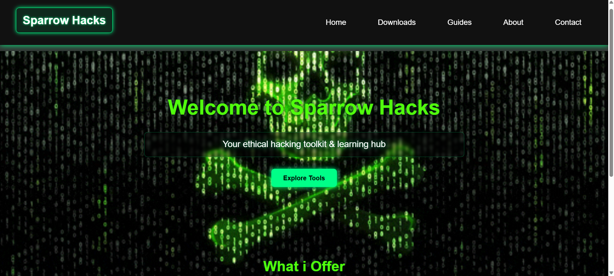

# Sparrow Hacks

Sparrow Hacks is a cybersecurity learning platform that provides ethical hacking tools, guides, and demonstrations for students and security enthusiasts. The platform aims to make cybersecurity concepts easier to understand by offering practical resources and a user-friendly interface.

---

## Features

## Features

* Ethical hacking tools for practice and learning
* Guides explaining cybersecurity concepts and techniques
* Demonstrations for security testing and vulnerability understanding
* Simple and clean user interface for easy navigation
* Educational resources for beginners in cybersecurity

---

## Technologies Used

* HTML
* CSS
* JavaScript
* Secure web development practices

---

## Security Implementation

The platform includes several security measures to demonstrate safe web development practices:

* Input validation
* Protection against Cross-Site Scripting (XSS)
* Protection against Cross-Site Request Forgery (CSRF)
* Basic injection attack mitigation
* Secure authentication design

---

## Purpose of the Project

The goal of Sparrow Hacks is to help beginners understand cybersecurity tools and techniques in a safe educational environment. It is designed for learning purposes and to demonstrate how security concepts can be implemented in real web applications.

---

## Project Structure

Sparrow Hacks includes:

* Web pages for cybersecurity guides and tools
* Demonstration content for ethical hacking concepts
* Interactive resources for learning security practices

---

## How to Run

1. Clone the repository
2. Open the project folder
3. Run the website using a local server or open the main HTML file in a browser

---

## Disclaimer

This project is created for **educational purposes only**. The tools and demonstrations provided are intended to help learners understand cybersecurity concepts responsibly.

---

## Author

**Sairaj Reddy**

Cybersecurity enthusiast focused on ethical hacking, vulnerability analysis, and security automation.

---
